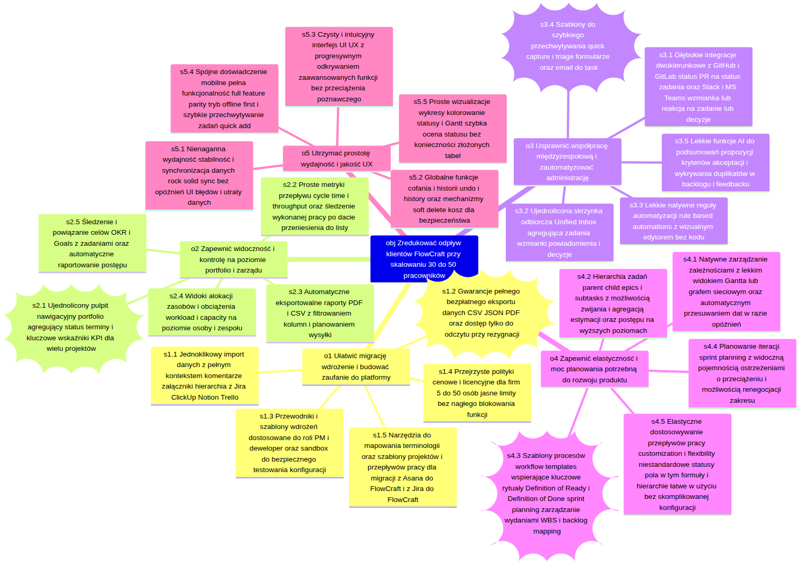
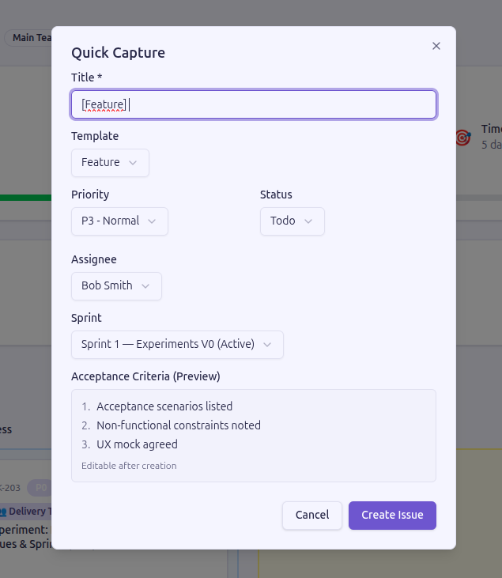
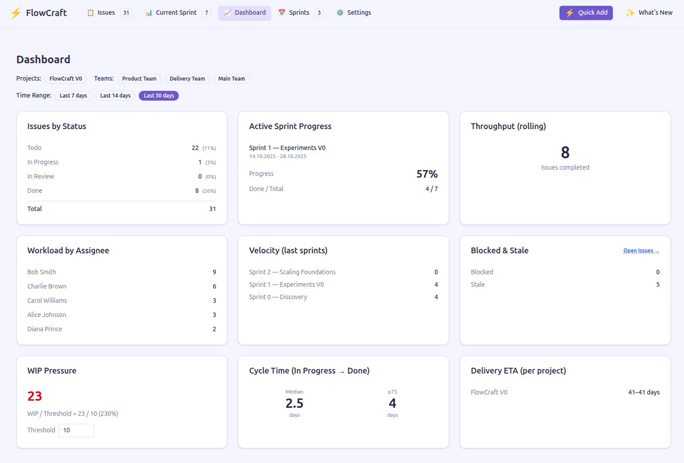
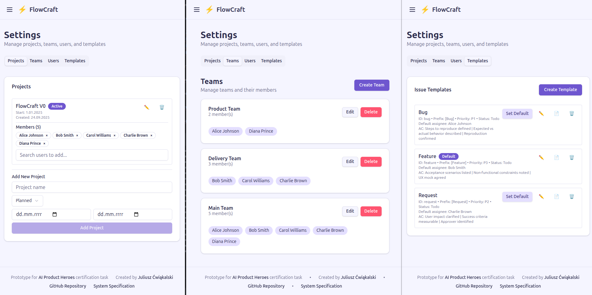
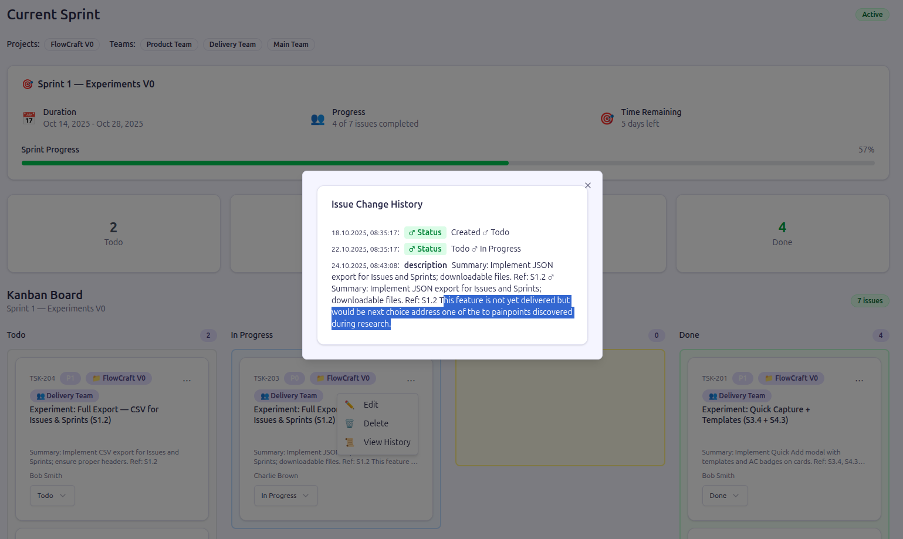
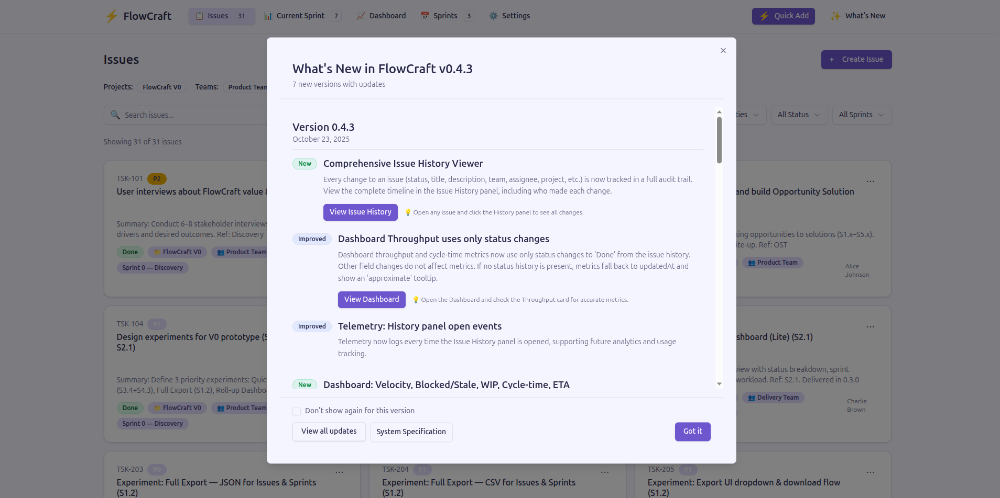

## Opis projektu na potrzeby certyfikacji AI Product Heroes

**Tytuł:** Transformacja FlowCraft: Od prostego narzędzia do skalowalnej platformy — prototyp redukujący churn.

**Streszczenie (Złota Nić - Golden Thread):**
FlowCraft traci klientów, gdy ich zespoły rosną do 30-50 osób, ponieważ "wyrastają" z narzędzia. Mój prototyp bezpośrednio atakuje główne przyczyny tego problemu, zdiagnozowane poprzez innowacyjny, oparty na AI proces discovery. Wprowadziłem dwie kluczowe funkcje: **błyskawiczne tworzenie zadań z szablonów (Quick Capture)**, by zredukować chaos i "pracę o pracy", oraz **zaawansowany analityczny Dashboard**, by dać managerom widok "z lotu ptaka", którego im brakowało. Te zmiany, wynikające wprost z mojego Opportunity Solution Tree, stanowią pierwszy, kluczowy krok w ewolucji FlowCraft w platformę, która rośnie razem z klientem, a nie go traci.

**Link do działającego prototypu:**
[https://v0-flow-craft-1-1-juliusz-cwiakals.vercel.app/](https://v0-flow-craft-1-1-juliusz-cwiakals.vercel.app/)

---

<!-- TOC -->
  * [Opis projektu na potrzeby certyfikacji AI Product Heroes](#opis-projektu-na-potrzeby-certyfikacji-ai-product-heroes)
    * [Szczegółowy opis projektu:](#szczegółowy-opis-projektu)
      * [1. Kontekst i Problem Biznesowy (Problem)](#1-kontekst-i-problem-biznesowy-problem)
      * [2. Mój Proces Odkrywczy (Discovery): Innowacyjne Wykorzystanie AI](#2-mój-proces-odkrywczy-discovery-innowacyjne-wykorzystanie-ai)
      * [3. Strategia i Priorytety (Discovery → OST → Prototyp)](#3-strategia-i-priorytety-discovery--ost--prototyp)
      * [4. Zaimplementowane Rozwiązania i ich Wpływ (OST → Prototyp = Złota Nić)](#4-zaimplementowane-rozwiązania-i-ich-wpływ-ost--prototyp--złota-nić)
        * [**Funkcjonalność 1: Quick Capture z Szablonami (Adresuje Opportunity 3 i 4 z OST)**](#funkcjonalność-1-quick-capture-z-szablonami-adresuje-opportunity-3-i-4-z-ost)
        * [**Funkcjonalność 2: Dashboard analityczny z filtrowaniem (Adresuje Opportunity 2 z OST)**](#funkcjonalność-2-dashboard-analityczny-z-filtrowaniem-adresuje-opportunity-2-z-ost)
        * [**Funkcje wspierające:**](#funkcje-wspierające)
    * [Podsumowanie: Dlaczego ten projekt zasługuje na wyróżnienie?](#podsumowanie-dlaczego-ten-projekt-zasługuje-na-wyróżnienie)
    * [Kluczowe Artefakty Projektu](#kluczowe-artefakty-projektu)
<!-- TOC -->

---

> **Nota:** Projekt ten jest rozszerzeniem i modyfikacją aplikacji bazowej [FlowCraft v1.0](https://go.kaca.la/v0-flowcraft-1.0) przygotowanej przez Piotra Kacałę na potrzeby kursu AI Product Heroes. Moja praca obejmowała przeprowadzenie pełnego procesu product discovery oraz implementację nowych, strategicznych funkcjonalności w oparciu o tę bazę.

### Szczegółowy opis projektu:

#### 1. Kontekst i Problem Biznesowy (Problem)

Głównym wyzwaniem strategicznym FlowCraft jest wysoki **odpływ klientów (churn)**, który następuje, gdy zespoły skalują się do 30-50 pracowników. Klienci cenią początkową prostotę FlowCraft, ale w miarę wzrostu napotykają na ograniczenia, które zmuszają ich do migracji na złożone i "ociężałe" systemy klasy enterprise (Jira, Monday.com). To egzystencjalne zagrożenie dla modelu biznesowego firmy, które ma zostać rozwiązane dzięki finansowaniu z Serii A.

#### 2. Mój Proces Odkrywczy (Discovery): Innowacyjne Wykorzystanie AI

Aby zrozumieć fundamentalne przyczyny churnu, nie oparłem się na ogólnikach. Stworzyłem **reużywalny, zautomatyzowany workflow w n8n, wspierany przez AI**, do analizy tysięcy frustracji zgłaszanych przez użytkowników konkurencyjnych platform. Opracowałem system scoringu, który pozwolił mi na automatyczne odsianie szumu i wyłonienie **tylko najbardziej wartościowych, powtarzających się problemów**, kluczowych dla redukcji churnu w FlowCraft.

Ten proces, szczegółowo opisany [w tym poście](https://bravecourses.circle.so/c/poglebione-dyskusje-aim/analiza-pain-points-z-reddita-w-koncu-w-miare-zadzialalo-hmm-overengeneering), pozwolił mi zidentyfikować pięć głównych bolączek, które bezpośrednio przekładają się na ograniczenia FlowCraft:
1.  **Fragmentacja narzędzi i "podatek koordynacyjny":** Zespoły toną w manualnej pracy, synchronizując statusy między Slackiem, Gitem a narzędziem do zadań.
2.  **Brak widoczności na poziomie portfolio:** Kadra zarządzająca nie ma skonsolidowanego widoku na postęp wielu projektów, co jest kluczowe przy skalowaniu.
3.  **Obawa przed "Vendor Lock-in":** Strach przed utratą danych i trudnościami w migracji blokuje zaufanie do platformy.
4.  **Niewystarczające możliwości planowania:** Brak zarządzania zależnościami i planowania mocy przerobowych uniemożliwia realizację złożonych projektów.
5.  **Niska wydajność i przeładowanie funkcji u konkurencji:** Użytkownicy uciekają od "ociężałych" narzędzi, ceniąc prostotę.

Cały ten proces, od surowych danych po syntezę problemów, został zrealizowany z pomocą AI, co zapewniło obiektywność i głębię analizy.

#### 3. Strategia i Priorytety (Discovery → OST → Prototyp)

**Opportunity Solution Tree (OST):** Zidentyfikowane problemy przekształciłem w strategiczne możliwości w ramach OST, gdzie nadrzędnym celem była **"Redukcja churnu"**. Drzewo możliwości pozwoliło mi zmapować konkretne rozwiązania (Solutions) na każdą z bolączek użytkowników.

**Priorytetyzacja i prototyp:** Zdawałem sobie sprawę, że w ramach prototypu V0 nie mogę zbudować wszystkiego. Korzystając z analizy MoSCoW i RICE, skupiłem się na rozwiązaniach, które oferowały **największy wpływ przy najmniejszym wysiłku implementacyjnym** w obecnej architekturze (frontend-only). Wybrałem eksperymenty, które celowały w dwie najdotkliwsze przyczyny churnu: chaos operacyjny na poziomie zespołu i brak strategicznego wglądu dla managerów.

#### 4. Zaimplementowane Rozwiązania i ich Wpływ (OST → Prototyp = Złota Nić)

Mój prototyp wprowadza funkcjonalności, które tworzą spójną historię – "Złotą Nić" – od problemu do przekonującej propozycji biznesowej. Co więcej, backlog zadań w prototypie odzwierciedla mój proces — zadania zrealizowane to te związane z analizą, a bieżący sprint to implementacja opisanych poniżej funkcji.

##### **Funkcjonalność 1: Quick Capture z Szablonami (Adresuje Opportunity 3 i 4 z OST)**

*   **Co to jest?** Błyskawiczny modal do tworzenia zadań (skrót klawiszowy "Q"), który wykorzystuje **w pełni zarządzalne szablony** (Bug, Feature, Request). Szablony automatycznie uzupełniają priorytet, status, a nawet **predefiniowane Kryteria Akceptacji (AC)**, co wspiera budowanie procesów takich jak Definition of Ready.
*   **Jak wynika z OST?** To bezpośrednia realizacja rozwiązań **S3.4 (Szablony do szybkiego przechwytywania)** i **S4.3 (Szablony procesów)**. Atakuje "podatek koordynacyjny", minimalizując tarcie przy dodawaniu zadań i standaryzując jakość wprowadzanych danych.
*   **Wpływ na churn:** Obniża barierę wejścia do FlowCraft jako "jedynego źródła prawdy". Zamiast zapisywać zadania w notatkach czy na Slacku, zespół może je dodać do systemu w mniej niż 10 sekund, zachowując porządek i kontekst. To kluczowe dla utrzymania porządku w rosnącym zespole.

##### **Funkcjonalność 2: Dashboard analityczny z filtrowaniem (Adresuje Opportunity 2 z OST)**

*   **Co to jest?** Nowy widok "Dashboard", który agreguje kluczowe metryki i wizualizuje postęp w czasie rzeczywistym. Obejmuje nie tylko podstawowe dane, ale również **zaawansowane wskaźniki kluczowe dla skalujących się zespołów**, takie jak Velocity, Cycle Time, WIP (Work-in-Progress) Pressure oraz prognozy dostarczenia (Delivery ETA). Całość jest w pełni filtrowalna według projektów i zespołów.
*   **Jak wynika z OST?** Jest to w pełni funkcjonalna wersja rozwiązania **S2.1 (Ujednolicony pulpit nawigacyjny portfolio)**. Daje managerom i liderom widok "z lotu ptaka", którego tak bardzo im brakuje w prostych narzędziach.
*   **Wpływ na churn:** To najważniejsza funkcja dla decydentów. Zamiast migrować do drogiej i skomplikowanej platformy tylko po to, by uzyskać podstawowe raporty, managerowie mogą teraz śledzić postępy bezpośrednio w FlowCraft. Możliwość filtrowania sprawia, że dane są kontekstowe i użyteczne dla konkretnych działów, co jest niezbędne w organizacji zatrudniającej 30+ osób.

##### **Funkcje wspierające:**
*   **Zarządzanie Projektami i Zespołami:** Stworzyłem panel ustawień, który jest fundamentem dla funkcji filtrowania na dashboardzie i pozwala na logiczną organizację pracy w rosnącej firmie.

*   **Szczegółowa historia zmian w zadaniach (Issue History):** Wdrożyłem mechanizm śledzenia każdej zmiany w zadaniach (status, przypisanie, tytuł). Jest to **technologiczny fundament dla dokładności metryk** na dashboardzie (np. Cycle Time, Throughput). Dodatkowo, pełna historia buduje zaufanie do platformy, dając zespołom audytowalność i transparentność, co adresuje obawy związane z "Vendor Lock-in" i utratą danych.

*   **Panel "What's New":** Aby upewnić się, że użytkownicy odkryją i zrozumieją nowe, potężne funkcje, wdrożyłem system powiadomień o zmianach.

### Podsumowanie: Dlaczego ten projekt zasługuje na wyróżnienie?

Mój projekt to nie tylko implementacja kilku funkcji. To strategiczna odpowiedź na realny problem biznesowy, poparta dogłębną, innowacyjną analizą i zwizualizowana w działającym prototypie.

1.  **Spójność (Problem → Discovery → OST → Prototyp):** Każda zaimplementowana funkcja ma bezpośrednie, logiczne powiązanie z konkretnym bólem użytkownika i rozwiązaniem zidentyfikowanym w OST. Mój proces discovery, oparty na AI, zapewnił, że celujemy w realne, a nie domniemane problemy.
2.  **"Złota Nić":** Całość tworzy przekonującą, 2-minutową historię o tym, jak FlowCraft może ewoluować, by zatrzymać swoich najcenniejszych, skalujących się klientów.
3.  **Propozycja Biznesowa:** Prototyp udowadnia, że FlowCraft może wypełnić lukę rynkową między prostymi listami zadań a molochami enterprise, stając się domyślnym wyborem dla startupów w fazie wzrostu.

### Kluczowe Artefakty Projektu

Wszystkie artefakty są dostępne w publicznym repozytorium projektu.

*   **Działający prototyp:** [https://v0-flow-craft-1-1-juliusz-cwiakals.vercel.app/](https://v0-flow-craft-1-1-juliusz-cwiakals.vercel.app/)
*   **Opportunity Solution Tree (OST):** [https://github.com/juliusz-cwiakalski/v0-flow-craft-1-1-juliusz-cwiakalski/blob/main/doc/product-discovery/ost-notebooklm.md](https://github.com/juliusz-cwiakalski/v0-flow-craft-1-1-juliusz-cwiakalski/blob/main/doc/product-discovery/ost-notebooklm.md)
*   **Wizualizacja OST (Diagram):** [https://github.com/juliusz-cwiakalski/v0-flow-craft-1-1-juliusz-cwiakalski/blob/main/doc/product-discovery/ost-diagram.md](https://github.com/juliusz-cwiakalski/v0-flow-craft-1-1-juliusz-cwiakalski/blob/main/doc/product-discovery/ost-diagram.md)
*   **Analiza Pain Points (wynik procesu AI):** [https://github.com/juliusz-cwiakalski/v0-flow-craft-1-1-juliusz-cwiakalski/blob/main/doc/product-discovery/pain-points-analysis-notebookml.md](https://github.com/juliusz-cwiakalski/v0-flow-craft-1-1-juliusz-cwiakalski/blob/main/doc/product-discovery/pain-points-analysis-notebookml.md)
*   **Roadmapa i Priorytetyzacja (RICE/MoSCoW):** [https://github.com/juliusz-cwiakalski/v0-flow-craft-1-1-juliusz-cwiakalski/blob/main/doc/product-discovery/roadmap-notebooklm.md](https://github.com/juliusz-cwiakalski/v0-flow-craft-1-1-juliusz-cwiakalski/blob/main/doc/product-discovery/roadmap-notebooklm.md)
*   **Definicje Eksperymentów Produktowych:** [https://github.com/juliusz-cwiakalski/v0-flow-craft-1-1-juliusz-cwiakalski/blob/main/doc/product-discovery/product-experiments.md](https://github.com/juliusz-cwiakalski/v0-flow-craft-1-1-juliusz-cwiakalski/blob/main/doc/product-discovery/product-experiments.md)
*   **Pełna Specyfikacja Funkcjonalna Prototypu:** [https://github.com/juliusz-cwiakalski/v0-flow-craft-1-1-juliusz-cwiakalski/blob/main/doc/spec/specification.md](https://github.com/juliusz-cwiakalski/v0-flow-craft-1-1-juliusz-cwiakalski/blob/main/doc/spec/specification.md)
*   **Dokumentacja Zmian i PRD:** [https://github.com/juliusz-cwiakalski/v0-flow-craft-1-1-juliusz-cwiakalski/tree/main/doc/changes](https://github.com/juliusz-cwiakalski/v0-flow-craft-1-1-juliusz-cwiakalski/tree/main/doc/changes)
*   **Główny README procesu Discovery:** [https://github.com/juliusz-cwiakalski/v0-flow-craft-1-1-juliusz-cwiakalski/blob/main/doc/product-discovery/README.md](https://github.com/juliusz-cwiakalski/v0-flow-craft-1-1-juliusz-cwiakalski/blob/main/doc/product-discovery/README.md)
