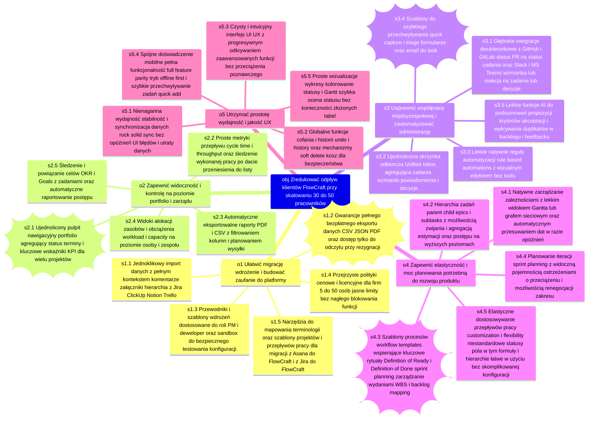

```mermaid
---
config:
  layout: tidy-tree
---
mindmap
  obj Zredukować odpływ klientów FlowCraft przy skalowaniu 30 do 50 pracowników
    o1 Ułatwić migrację wdrożenie i budować zaufanie do platformy
      s1.1 Jednoklikowy import danych z pełnym kontekstem komentarze załączniki hierarchia z Jira ClickUp Notion Trello
      s1.2))"s1.2 Gwarancje pełnego bezpłatnego eksportu danych CSV JSON PDF oraz dostęp tylko do odczytu przy rezygnacji"((
      s1.3 Przewodniki i szablony wdrożeń dostosowane do roli PM i deweloper oraz sandbox do bezpiecznego testowania konfiguracji
      s1.4 Przejrzyste polityki cenowe i licencyjne dla firm 5 do 50 osób jasne limity bez nagłego blokowania funkcji
      s1.5 Narzędzia do mapowania terminologii oraz szablony projektów i przepływów pracy dla migracji z Asana do FlowCraft i z Jira do FlowCraft
    o2 Zapewnić widoczność i kontrolę na poziomie portfolio i zarządu
      s2.1))"s2.1 Ujednolicony pulpit nawigacyjny portfolio agregujący status terminy i kluczowe wskaźniki KPI dla wielu projektów"((
      s2.2 Proste metryki przepływu cycle time i throughput oraz śledzenie wykonanej pracy po dacie przeniesienia do listy
      s2.3 Automatyczne eksportowalne raporty PDF i CSV z filtrowaniem kolumn i planowaniem wysyłki
      s2.4 Widoki alokacji zasobów i obciążenia workload i capacity na poziomie osoby i zespołu
      s2.5 Śledzenie i powiązanie celów OKR i Goals z zadaniami oraz automatyczne raportowanie postępu
    o3 Usprawnić współpracę międzyzespołową i zautomatyzować administrację
      s3.1 Głębokie integracje dwukierunkowe z GitHub i GitLab status PR na status zadania oraz Slack i MS Teams wzmianka lub reakcja na zadanie lub decyzje
      s3.2 Ujednolicona skrzynka odbiorcza Unified Inbox agregująca zadania wzmianki powiadomienia i decyzje
      s3.3 Lekkie natywne reguły automatyzacji rule based automations z wizualnym edytorem bez kodu
      s3.4))"s3.4 Szablony do szybkiego przechwytywania quick capture i triage formularze oraz email do task"((
      s3.5 Lekkie funkcje AI do podsumowań propozycji kryteriów akceptacji i wykrywania duplikatów w backlogu i feedbacku
    o4 Zapewnić elastyczność i moc planowania potrzebną do rozwoju produktu
      s4.1 Natywne zarządzanie zależnościami z lekkim widokiem Gantta lub grafem sieciowym oraz automatycznym przesuwaniem dat w razie opóźnień
      s4.2 Hierarchia zadań parent child epics i subtasks z możliwością zwijania i agregacją estymacji oraz postępu na wyższych poziomach
      s4.3))"s4.3 Szablony procesów workflow templates wspierające kluczowe rytuały Definition of Ready i Definition of Done sprint planning zarządzanie wydaniami WBS i backlog mapping"((
      s4.4 Planowanie iteracji sprint planning z widoczną pojemnością ostrzeżeniami o przeciążeniu i możliwością renegocjacji zakresu
      s4.5 Elastyczne dostosowywanie przepływów pracy customization i flexibility niestandardowe statusy pola w tym formuły i hierarchie łatwe w użyciu bez skomplikowanej konfiguracji
    o5 Utrzymać prostotę wydajność i jakość UX
      s5.1 Nienaganna wydajność stabilność i synchronizacja danych rock solid sync bez opóźnień UI błędów i utraty danych
      s5.2 Globalne funkcje cofania i historii undo i history oraz mechanizmy soft delete kosz dla bezpieczeństwa
      s5.3 Czysty i intuicyjny interfejs UI UX z progresywnym odkrywaniem zaawansowanych funkcji bez przeciążenia poznawczego
      s5.4 Spójne doświadczenie mobilne pełna funkcjonalność full feature parity tryb offline first i szybkie przechwytywanie zadań quick add
      s5.5 Proste wizualizacje wykresy kolorowanie statusy i Gantt szybka ocena statusu bez konieczności złożonych tabel

```
