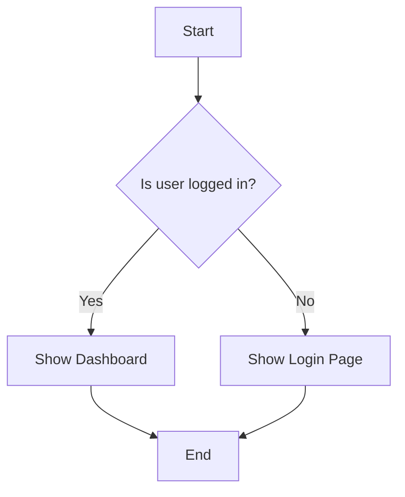

# Feature: [Feature Name]

**Version:** 1.0  
**Last Updated:** YYYY-MM-DD  
**Status:** Implemented | In Development | Deprecated

---

## 1. Overview

A brief, one-paragraph summary of the feature and its purpose. This should be the "elevator pitch" for the feature,
explaining what it is and for whom.

---

## 2. Business Context

This section describes the "why" behind the feature. It connects the functionality to user needs and business
objectives.

### 2.1. Problem Statement

_What specific problem, need, or opportunity does this feature address for our users?_

- **The Problem:** Describe the user's pain point in a few sentences.
- **Who It Affects:** Define the target user persona(s) (e.g., New users, busy professionals, families).
- **Impact of the Problem:** Explain the consequences of the problem (e.g., Wasted time, food waste, difficulty in meal
  planning).

### 2.2. Business Goals

_What are the desired business outcomes for this feature?_

- **Primary Goal:** State the main measurable objective (e.g., Increase user engagement by 15%).
- **Secondary Goals:**
  - (e.g., Improve retention of new users during their first week).
  - (e.g., Create upsell opportunities for premium features).

---

## 3. Feature Description & User Experience

This section details what the feature is, how it works from a user's perspective, and the value it provides.

### 3.1. Key Functionalities

A bulleted list of the main capabilities the user gains with this feature.

- **Capability 1:** (e.g., Users can scan ingredients using their device camera.)
- **Capability 2:** (e.g., The system automatically recognizes and lists the scanned ingredients.)
- **Capability 3:** (e.g., Users can manually correct or add ingredients to the list.)

### 3.2. User Stories

| As a... (User Persona) | I want to... (Action)             | So that I can... (Benefit)                  |
| ---------------------- | --------------------------------- | ------------------------------------------- |
| _Busy Parent_          | _Quickly add all my fridge items_ | _Get meal suggestions without manual entry_ |

### 3.3. User Flows & Processes

Describe the step-by-step journey a user takes to interact with this feature. Diagrams are highly encouraged.

**Main User Flow:**

1. User navigates to the Inventory screen.
2. User taps the "Add Photo" button.
3. ...

**(Optional) Diagrams:**
_Use Mermaid or link to diagrams (e.g., in Figma, Miro) to visualize the flow._

### 3.4. Edge Cases & Alternative Flows

- What happens if the camera fails to open?
- What if the image recognition returns no results?
- What if the user is offline?

---

## 4. Business Rules & Constraints

A list of specific rules, constraints, and logic that govern the feature's behavior.

- A user can upload a maximum of 5 photos per inventory scan.
- Ingredient recognition confidence below 70% requires user confirmation.
- The feature is only available to premium users.

---

## 5. Technical Implementation

This section provides an overview of the technical architecture and key components involved in implementing the feature.
It should be detailed enough for a developer to understand the feature's structure.

### 5.1. Key Components & Files

| Path                                    | Component/File Name     | Purpose                                                              |
| --------------------------------------- | ----------------------- | -------------------------------------------------------------------- |
| `src/pages/InventoryPage.tsx`           | `InventoryPage`         | The main page component that orchestrates the feature.               |
| `src/features/inventory/components/...` | `CameraCapture`         | Component responsible for accessing the camera and capturing images. |
| `src/features/inventory/slices/...`     | `inventorySlice`        | Redux slice managing the state of the user's inventory.              |
| `src/services/RecognitionAPI.ts`        | `RecognitionAPIService` | Service for communicating with the external image recognition API.   |

### 5.2. Data Models & State Management

- **Redux Slice:** `inventorySlice`
  - `status`: 'idle' | 'loading' | 'succeeded' | 'failed'
  - `items`: An array of `Ingredient` objects.
  - `error`: Stores any error messages.
- **Key Types:** (Reference `src/features/inventory/types/index.ts`)
  - `Ingredient`: Represents a single recognized item.
  - `ImageRef`: Reference to a stored photo.

### 5.3. External Dependencies & APIs

- **API:** Google Vision AI
  - **Purpose:** Image recognition.
  - **Endpoint:** `https://vision.googleapis.com/v1/images:annotate`
  - **Authentication:** API Key.
- **Library:** `react-webcam`
  - **Purpose:** To access the device camera from the browser.

---

## 6. Design & UI

Links to relevant design files, mockups, or key screenshots that define the user interface.

- [Figma Mockups](https://figma.com/...)
- [UI Component Storybook](https://storybook.example.com/...)

---

## 7. Related Documents & References

A curated list of documents that influenced the scope, requirements, and design of this feature. Link to the specific items and briefly state their relevance.

- Architectural Decision Records (ADRs):
  - ADR-XXXX: [Title] — Key decision and constraint.
- Change Documents:
  - changes/00X-some-change.md — Summary of impact on this feature.
- Related Features:
  - [Feature Name or Spec] — Dependency, overlap, or integration notes.
- Design Artifacts:
  - Figma/Miro link — Short note on what this covers.
- Research & Notes:
  - User research summaries, experiments, or analytics dashboards.

Tip: Prefer permanent links and versioned references where applicable.

## 8. Relevant Code Modules & Classes

Identify the core modules and classes to review when working on this feature. Provide paths and a short rationale for each entry.

- Entry points:
  - src/pages/[FeatureName]Page.tsx — Top-level page orchestrating the feature.
  - src/features/[featureName]/index.ts — Public surface and exports (if present).
- UI and UX:
  - src/features/[featureName]/components/... — Feature-specific UI.
  - src/components/... — Shared components reused here (e.g., ScreenSection, LoadingOverlay).
- State and data:
  - src/features/[featureName]/slices/... — Redux slice, actions, selectors.
  - src/features/[featureName]/types/... — Domain types for this feature.
  - src/features/[featureName]/services/... — API/service clients.
  - src/features/[featureName]/utils/... — Pure helpers and mappers.
  - src/features/[featureName]/hooks/... — Business logic hooks.
- Cross-cutting concerns:
  - src/features/i18n/... — Translation keys and config.
  - src/features/analytics/... — Tracking hooks/services.
  - src/redux/... — Global store setup and middleware.
  - src/hooks/useDeviceType.ts — Responsive behavior helper.
  - src/theme.ts — Theme variables affecting UI.

Suggested table for quick reference:

| Path                                             | Module/Class    | Responsibility & Notes             |
| ------------------------------------------------ | --------------- | ---------------------------------- |
| src/features/[featureName]/slices/[slice].ts     | [SliceName]     | State shape, actions, selectors    |
| src/features/[featureName]/services/[service].ts | [ServiceName]   | Data fetching and side effects     |
| src/pages/[FeatureName]Page.tsx                  | [PageComponent] | Orchestration, layout, and routing |

Customize this section for the feature; remove irrelevant entries and add precise module names.

## 9. Document History

| Version | Date       | Author        | Summary of Changes                             |
| ------- | ---------- | ------------- | ---------------------------------------------- |
| 1.0     | YYYY-MM-DD | [Author Name] | Initial creation of the feature specification. |
